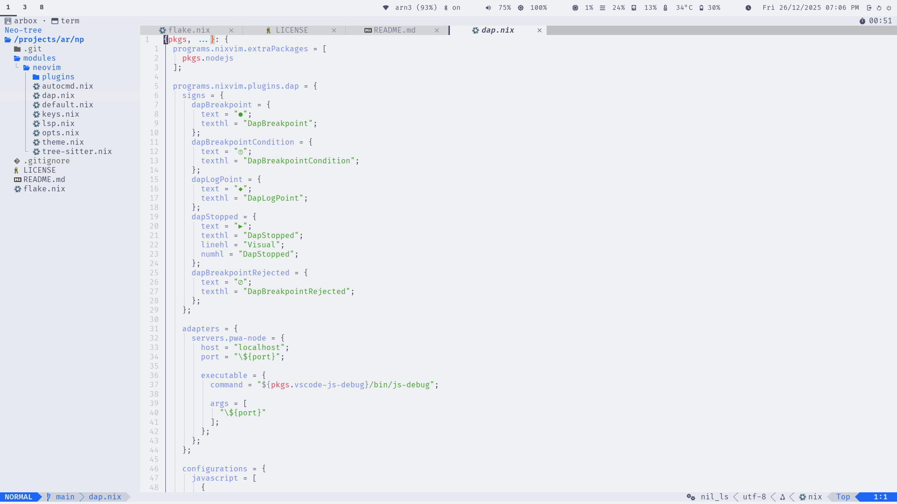

# Default Experience

This page describes the out-of-the-box experience when using `np` without any
presets or customizations. It's the base NixVim configuration that provides a
complete, project-oriented Neovim setup.

## Overview

`np` ships with a curated set of plugins, keybindings, and settings designed
for efficient development. The focus is on usability, discoverability,
and non-pollution—everything stays project-specific via Nix.

Key highlights:

- **Leader Key**: Space (`<Space>`)
- **Theme**: Catppuccin with full UI integration
- **Session Management**: Automatic save/restore for git repositories
- **Completion**: Blink.cmp with LSP integration
- **Search**: Snacks picker for fuzzy finding
- **Diagnostics**: Trouble for workspace issues, custom signs and virtual text

## UI & Theme

The interface uses Catppuccin theme with integrations for a cohesive look.

- **Status Line**: Lualine with LSP status, git info, and diagnostics
- **Buffer Tabs**: Bufferline with close buttons and indicators
- **File Explorer**: Neo-tree sidebar with git status
- **Notifications**: Noice for command-line and messages
- **Diagnostics Panel**: Trouble for workspace-wide issues
- **Key Hints**: Which-key for discoverable bindings

### Screenshots

#### Editor View



#### Which-Key


#### LSP


#### Lazygit


## Language Support

### LSP Servers

Out-of-the-box support for common config and markup languages:

- **Lua**: lua_ls (with inlay hints)
- **JSON**: jsonls
- **Markdown**: marksman
- **Nix**: nil_ls
- **TOML**: taplo
- **YAML**: yamlls

Diagnostics include custom signs (e.g., `` for errors) and virtual text with spacing.

### Tree-Sitter Parsers

Syntax highlighting and folding for:

- bash, json, lua, markdown, nix, regex, toml, vim, vimdoc, yaml

Folding uses indent method with custom characters.

## Keybindings

Bindings are grouped logically under `<leader>` (space). Use `<leader>?` or
Which-key to explore.

### Core Categories

- **Windows** (`<leader>w`): Navigation, resizing, splitting
- **Buffers** (`<leader>b`): Switching, deleting, pinning
- **Tabs** (`<leader><tab>`): New, close, navigate
- **Explorer** (`<leader>e`): Neo-tree toggle/reveal
- **Code/LSP** (`<leader>c`): Rename, actions, definitions, diagnostics
- **Search** (`<leader>s`): Files, buffers, grep, replace
- **Git** (`<leader>g`): Lazygit, hunks, blame, log
- **Notifications** (`<leader>n`): History, dismiss
- **Session** (`<leader>sl`): Load last session
- **Debugger** (`<leader>d`): Breakpoints, stepping, UI

### Examples

- `<leader>sf`: Search files
- `<leader>cd`: Go to LSP definitions
- `<leader>gg`: Open Lazygit
- `<C-s>`: Save file (insert/visual/normal modes)


## Plugins

The base setup includes these enabled plugins (categorized):

### Completion & LSP

- blink-cmp: Fast completion
- lsp: Core LSP support
- lsp-signature: Function signatures
- lsp-status: Status indicators
- navic: Breadcrumb navigation

### UI & Navigation

- bufferline: Buffer tabs
- edgy: Window management
- lualine: Status line
- neo-tree: File explorer
- noice: Notifications
- trouble: Diagnostics panel
- web-devicons: Icons
- which-key: Key hints

### Development Tools

- conform-nvim: Formatting
- dap, dap-ui, dap-view, dap-virtual-text: Debugging
- git-conflict: Merge conflict resolution
- gitsigns: Git hunks and blame
- lazydev: Lua development
- none-ls: Linting/formatting bridge
- toggleterm: Terminal integration
- treesitter: Syntax parsing

### Utilities

- colorizer: Color previews
- emmet: HTML/CSS snippets
- grug-far: Search & replace
- markview: Markdown rendering
- mini: Collection of small plugins
- snacks: Picker, notifications, terminal
- ts-autotag: Auto-close tags
- ts-comments: Enhanced comments

### Extra Plugins

- plenary-nvim: Lua utilities
- nvim-lsp-file-operations: LSP file ops

## Session Management

For git repositories, `np` automatically:

- Saves session on exit (VimLeavePre) to `.nvim/session.vim`
- Restores session on start (VimEnter) if no files specified
- Handles Neo-tree windows properly
- Adds `.nvim/` to `.gitignore` if needed

This enables Project-Oriented Development—no global state, per-project persistence.

## Customization

The base is designed to be extended:

- Add presets for language support (see [Presets](./presets/README.md))
- Override NixVim options in your project's `nix/nixvim.nix`
- Disable unwanted plugins or add new ones

For example, to add Python support:

```nix
imports = [
  inputs.np.nixvimModules.base
  inputs.np.nixvimModules.presets.python
];
```

This keeps your setup clean and reproducible.
